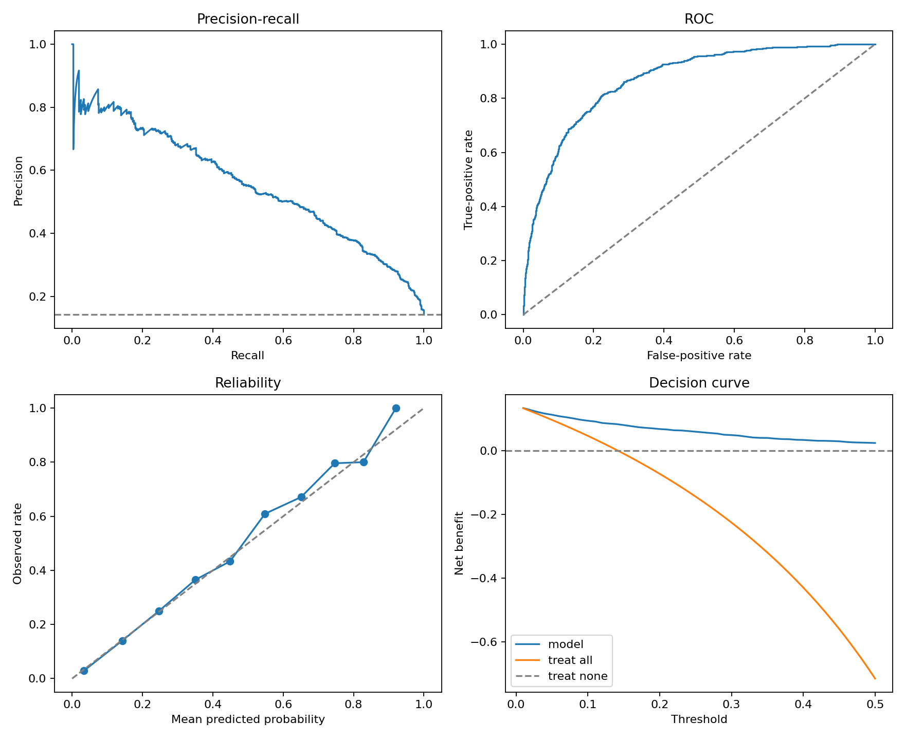
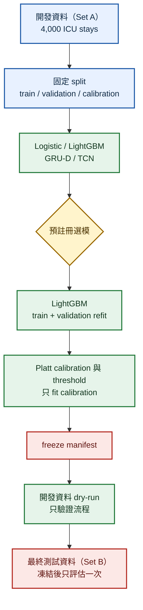
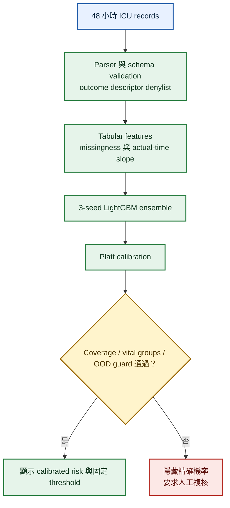

# CareRisk 48H

> 僅供研究與教育，不是臨床診斷、治療或照護決策工具。

CareRisk 48H 使用 [PhysioNet Challenge 2012](https://physionet.org/content/challenge-2012/1.0.0/) ICU 入院前 48 小時資料研究住院死亡風險。重點是可重現 split、防洩漏、calibration、預註冊選模與一次性 final evaluation，而非只追求單一分數。

## 資料怎麼使用

PhysioNet 將資料分成數個官方集合；Set A／Set B 是資料分組名稱，不是模型版本或成績等級。

| README 名稱 | 官方名稱 | 用途 |
| --- | --- | --- |
| 開發資料 | Set A（4,000 ICU stays） | 用於 training、validation、calibration、模型選擇與 freeze 前檢查。 |
| 最終測試資料 | Set B（另 4,000 ICU stays） | 模型與 threshold 全部凍結後只評估一次；下方正式結果來自這組資料。 |

## 正式結果

依預註冊規則，GRU-D 與 TCN 未達到超越最佳 tabular model 的門檻，因此選用較簡單的 3-seed LightGBM ensemble，搭配 Platt calibration 與固定 threshold。最終測試資料（Set B）僅成功評估一次，confidence interval 使用 2,000 次 stratified bootstrap。

<!-- RESULTS_START -->
| Frozen model | Split | AUPRC (95% CI) | AUROC (95% CI) | Brier (95% CI) | ECE (95% CI) | Sensitivity @ ≥90% specificity | Threshold |
| --- | --- | --- | --- | --- | --- | --- | --- |
| lightgbm | 最終測試資料（Set B） | 0.555 (0.516–0.594) | 0.870 (0.855–0.884) | 0.087 (0.083–0.090) | 0.008 (0.007–0.019) | 0.581 @ 0.909 specificity | 0.297 |
<!-- RESULTS_END -->

完整精度、bootstrap 設定與安全 provenance hashes 見 [Machine-readable final-result receipt](docs/final-result-receipt.json)。

這些數值不構成 clinical validity、部署核准或跨場域可遷移證據。

## 結果一眼看懂

| 指標 | 正式結果 | 如何閱讀 |
| --- | --- | --- |
| AUPRC | 0.555（95% CI 0.516–0.594） | 主要指標，適合 outcome 不平衡的資料；越高越好。 |
| AUROC | 0.870（95% CI 0.855–0.884） | 衡量模型把高風險個案排在前面的能力；越高越好。 |
| ECE | 0.008（95% CI 0.007–0.019） | 預測機率與實際比例的 calibration error；越接近 0 越好。 |
| 固定 operating point | Sensitivity 58.1%、specificity 90.9% | 在優先維持至少 90% specificity 的前提下，辨識約 58% 的死亡個案。 |



圖中左上為 Precision–Recall、右上為 ROC、左下為 Reliability、右下為 Decision curve。Decision curve 只呈現不同 threshold 下的描述性 net benefit，不等於 clinical utility validation。

## 研究流程



Model seeds 固定為 `17`、`42`、`2026`。Preprocessor 只 fit train 或 final refit 的 train+validation；calibrator 與 threshold 只 fit calibration。

## Inference safety flow



輸入 schema、禁止欄位、coverage、核心 vital groups 或 OOD guard 未通過時，demo 會拒絕輸入或隱藏精確機率。

## 快速開始

```powershell
python -m venv .venv
.venv\Scripts\python -m pip install -e ".[dev,tabular,app]"
.venv\Scripts\python -m pytest
.venv\Scripts\carerisk-train --config configs/quick.yaml --synthetic
```

開發資料（Set A）準備與完整 tabular training：

```powershell
.venv\Scripts\python scripts/download_physionet.py --raw-dir data/raw --set a
.venv\Scripts\python scripts/generate_data_quality.py
.venv\Scripts\python scripts/train_tabular.py --config configs/full.yaml
```

Deep experiments 使用 [CareRisk48H_Deep_Experiments_Colab.ipynb](notebooks/CareRisk48H_Deep_Experiments_Colab.ipynb)：資料準備使用 Colab CPU，training 使用 L4；quick mode 只能作 synthetic smoke。

Synthetic safety demo：

```powershell
.venv\Scripts\python scripts/build_demo_bundle.py
.venv\Scripts\python app.py
```

## 研究邊界與限制

- Outcome 固定為 `In-hospital_death`；`SAPS-I`、`SOFA`、`Length of stay`、`Survival` 與 outcome descriptors 永不作為 features。
- 開發資料（Set A）用於 development；最終測試資料（Set B）在 freeze 後只 final evaluation 一次；官方 Set C 完全不使用。
- 原始資料、processed data、models、predictions、reports、checkpoints 與 final ledger/lock 不提交 Git。
- 2012 ICU cohort 存在 temporal/practice shift；missingness 也可能反映量測與照護流程。
- ICU outcome、監測密度與照護情境不同於長照；本模型不能直接遷移至長照或其他場域。
- Error 與 subgroup analyses 只作描述，不代表 fairness 或 causal conclusions。

完整限制與方法見 [MODEL_CARD.md](MODEL_CARD.md) 與 [DATA_CARD.md](DATA_CARD.md)。引用資訊見 [CITATION.cff](CITATION.cff)；程式碼採 [Apache-2.0](LICENSE)，資料依 PhysioNet 的 [ODC-By 1.0](https://physionet.org/content/challenge-2012/view-license/1.0.0/) 使用，詳見 [NOTICE](NOTICE)。
