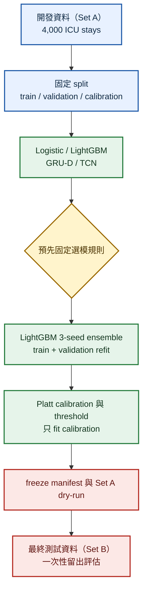
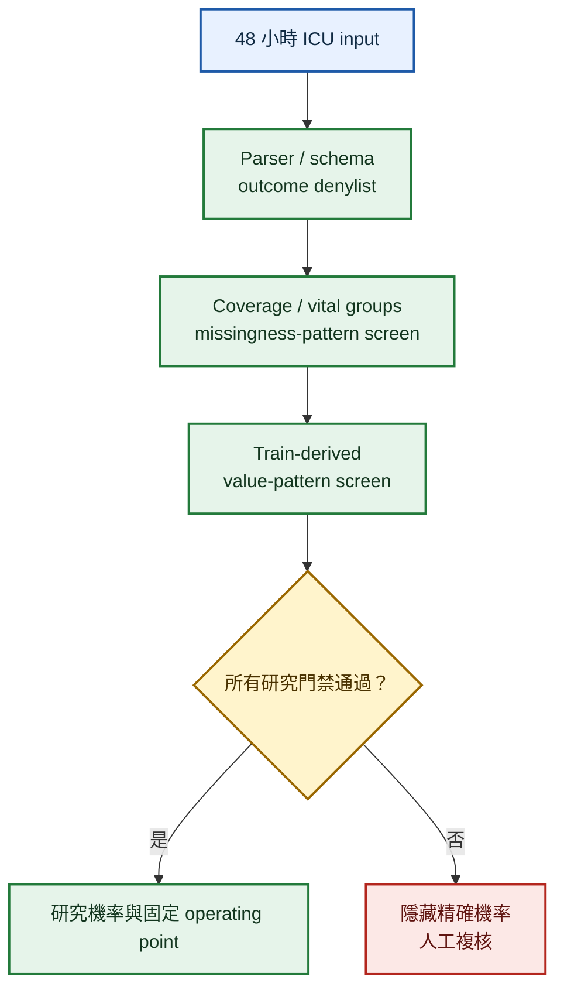

# CareRisk 48H

[](https://github.com/kuotunyu/CareRisk-48H/actions/workflows/ci.yml)
[](https://github.com/kuotunyu/CareRisk-48H/releases/tag/v0.2.0)


[](LICENSE)

CareRisk 48H 是可信賴 clinical ML 的研究軟體範例，使用 [PhysioNet Challenge 2012](https://physionet.org/content/challenge-2012/1.0.0/) ICU 入院最初 48 小時資料研究住院死亡風險。重點是可重現 split、防洩漏、機率校準、事前選模、abstention 與可稽核評估，不是臨床產品。

> 僅供研究與教育；不是臨床診斷、治療、分流、資源配置或照護決策工具。

版本狀態：`v0.2.0` 是目前的 research-software／portfolio release。它封存 `v0.1.0` 之後完成的 calibration stability、monitoring、abstention guard、synthetic-only demo 與 evidence documentation 強化；**凍結的 Set B 科學結果沒有重跑、沒有改值，Set C 仍完全未使用**。版本與 frozen scientific receipt 的關係另見 [`docs/release-v0.2.0.json`](docs/release-v0.2.0.json)。

## Cohort 與資料角色

這是 48 小時 landmark cohort：官方納入年齡至少 16 歲、首次可用 ICU stay，且 initial ICU stay 至少 48 小時的個案；DNR/CMO 並未排除。模型因此只適用於已達 48 小時 landmark 的歷史 ICU cohort，不能代表入 ICU 後 48 小時內即離院或死亡者，也不能直接代表一般病房、長照或居家照護。

資料來自單一機構 Beth Israel Deaconess Medical Center 的 MIMIC-II（2001–2007），涵蓋 medical、surgical、coronary 與 cardiac surgery recovery 四種 adult ICU type。PhysioNet 將 12,000 stays 隨機分成 Set A／B／C，各 4,000 筆；它們是同一歷史來源的隨機分組，不是模型版本、醫院分組或成績等級。本研究沒有 chronological 或 site-held-out validation，也沒有 external 或 prospective validation。

| README 名稱 | 官方名稱 | 用途 |
| --- | --- | --- |
| 開發資料（Set A） | 4,000 ICU stays | 固定 train／validation／calibration split、選模、refit、Platt calibration、threshold 與 freeze 前檢查。 |
| 最終測試資料（Set B） | 另 4,000 ICU stays | 所有選擇凍結後，執行一次自我稽核的一次性留出評估。 |
| 未使用資料 | Set C | 完全排除，不作開發或報告。 |

來源 cohort 只保留每位病人的首次可用 ICU stay，降低同一病人跨 stay leakage；repository 另驗證各 split 的 `RecordID` 不重疊。因公開資料沒有可供獨立 cross-stay linkage 的 patient identifier，病人層級唯一性仍依賴官方 cohort 定義。

## 研究流程



Model seeds 固定為 `17`、`42`、`2026`。Preprocessing、imputation、scaling 與 feature selection 只 fit 允許的開發 split；`In-hospital_death` 是唯一 label，`SAPS-I`、`SOFA`、`Length_of_stay`、`Survival`、outcome descriptors 與 `RecordID` 永不作為 features。

## 正式結果

依事前固定規則，GRU-D 與 TCN 未同時達到超越最佳 tabular model 的 AUPRC 與 calibration promotion gates，因此選用較簡單的 3-seed LightGBM ensemble。以下結果來自凍結後的自我稽核一次性 Set B holdout；它是同來源 random holdout，不是 temporal、site 或 external validation。

<!-- RESULTS_START -->
| Frozen model | Split | AUPRC (95% CI) | AUROC (95% CI) | Brier (95% CI) | ECE (95% CI) | Sensitivity @ ≥90% specificity | Threshold |
| --- | --- | --- | --- | --- | --- | --- | --- |
| lightgbm | 最終測試資料（Set B） | 0.555 (0.516–0.594) | 0.870 (0.855–0.884) | 0.087 (0.083–0.090) | 0.008 (0.007–0.019) | 0.581 @ 0.909 specificity | 0.297 |
<!-- RESULTS_END -->

完整精度、bootstrap 設定與安全 provenance hashes 見 [Machine-readable final-result receipt](docs/final-result-receipt.json)。這些數值不構成 clinical validity、部署核准或跨場域可遷移證據。

## 結果一眼看懂

| 指標 | 正式結果 | 如何閱讀 |
| --- | --- | --- |
| AUPRC | 0.555（95% CI 0.516–0.594） | 主要 discrimination 指標，適合 outcome imbalance；不能單獨表示臨床效用。 |
| AUROC | 0.870（95% CI 0.855–0.884） | 描述同來源留出資料中的排序能力。 |
| 10-bin ECE | 0.008（95% CI 0.007–0.019） | 此 historical same-source holdout 的 fixed-width calibration error；小值不等於外部或個案層級可靠性。 |
| research operating point | Sensitivity 58.1%、specificity 90.9% | threshold 只由 Set A calibration 依預定規則選取，不是經臨床成本、傷害或工作流程驗證的決策界線。 |

### Set A calibration／threshold stability

在原本 600 筆 Set A calibration split 上，以固定 seed 2026 做 2,000 次 outcome-stratified bootstrap：apparent calibration intercept 為 `-0.0002`（percentile range `-0.273–0.329`），slope 為 `1.000`（`0.833–1.220`）；research threshold 點估計 `0.297` 的 range 為 `0.267–0.340`，對應 sensitivity `0.530`（`0.410–0.651`）與 specificity `0.907`（`0.901–0.925`）。

這是同一 calibration split 上、對已 fit Platt probabilities 的 internal/apparent resampling diagnostic；接近 0／1 的 intercept／slope 點估計部分反映 in-sample fit，區間則顯示小 calibration sample 的不確定性。它不是 external calibration、calibrator-refit uncertainty 或 threshold clinical utility evidence。可重現工具為 `scripts/analyze_calibration_stability.py`。


圖中 decision curve 是不同 threshold 下的描述性 decision curve analysis；其 harm ratio 是數學假設，沒有經臨床 action、cost 或 utility study 驗證。

## 推論安全與 abstention



Demo 的 `missingness/value-pattern anomaly guard` 使用 train-only coverage、measurement count、vital-group、missingness pattern 與 robust value-pattern signals。它會觸發 abstention，但不是 physiological unit validator、external OOD detector 或臨床 safety system。凍結 Set B candidate 是 batch research artifact；public demo 則使用 synthetic-only bundle，兩者不能混稱為 deployable clinical model。

公開介面與研究說明：

- [Inference JSON Schema](configs/inference_schema.json)
- [MODEL_CARD.md](MODEL_CARD.md)
- [DATA_CARD.md](DATA_CARD.md)
- [MONITORING.md](MONITORING.md)
- [TRIPOD+AI / PROBAST+AI evidence audit](docs/TRIPOD_PROBAST_AUDIT.md)
- [CITATION.cff](CITATION.cff)

## 快速開始

```powershell
python -m venv .venv
.\.venv\Scripts\python -m pip install -e ".[dev,tabular,app]"
.\.venv\Scripts\python -m pytest
.\.venv\Scripts\carerisk-train --config configs/quick.yaml --synthetic
```

開發資料（Set A）需由使用者依官方授權自行下載。一般 CI 只使用 synthetic／mocked data、CPU，且不下載 PhysioNet。

Synthetic safety demo：

```powershell
.\.venv\Scripts\python scripts/build_demo_bundle.py
.\.venv\Scripts\python app.py
```

介面以正體中文（`zh-TW`）為主，並保留 `calibration`、`abstention`、`missingness`、`research operating point`、model／feature／schema 名稱等專有名詞原文。預設 synthetic fixture 可一鍵執行；fixture JSON 與 machine-readable output 預設收合，結果會先顯示 `evidence gates` 與是否需要人工複核，再決定是否呈現合成示範分數。

這個互動介面只使用 synthetic data 與 synthetic-only bundle，不是 frozen Set B candidate 的臨床前端。分數僅是 demonstration value，`research operating point` 不是臨床 action threshold，`model signals` 也只具描述性、非因果意義。

## 研究邊界

- 48 小時 eligibility 造成 landmark selection；結果不涵蓋早期死亡或早期離 ICU 的個案。
- 2012 ICU 資料存在 temporal、practice、equipment 與 population shift；缺少 contemporary external validation。
- Missingness 可能編碼病況、量測政策、資源與 clinician behavior，不能作因果解釋。
- Subgroup results 是小樣本描述，不支持 fairness claim。
- ICU outcome、監測密度與照護情境與長照不同；本模型不能直接遷移至長照。
- 任何 clinical use 都需要獨立資料、前瞻性評估、human factors、治理、監測與失效處置；本專案沒有提供這些證據。

程式碼採 [Apache-2.0](LICENSE)。資料依 PhysioNet 的 [ODC-By 1.0](https://physionet.org/content/challenge-2012/view-license/1.0.0/) 使用，且不包含在 repository 中，詳見 [NOTICE](NOTICE)。
