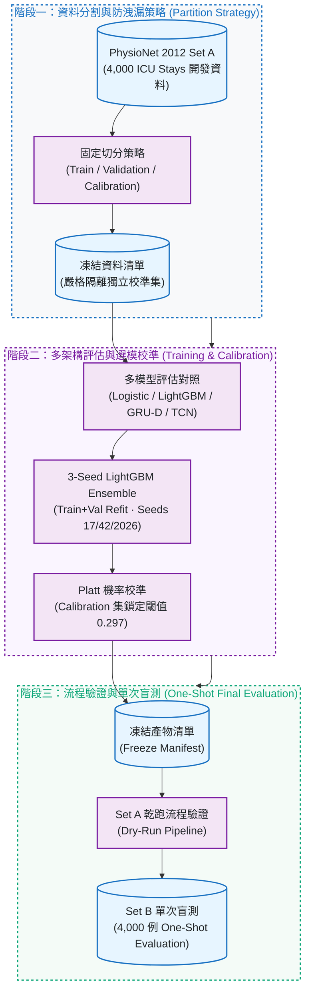
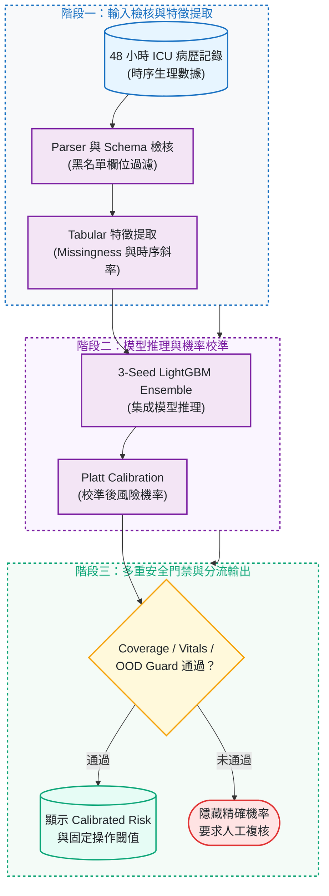

# CareRisk 48H

[](https://github.com/kuotunyu/CareRisk-48H/actions/workflows/ci.yml)
[](https://github.com/kuotunyu/CareRisk-48H/releases/tag/v0.1.0)


[](LICENSE)

本專案基於 **PhysioNet Challenge 2012** 重症加護病房 (ICU) 入院前 48 小時生理時序資料，建立住院死亡風險預測與推論安全防護系統：著重於可重現資料分割、嚴格防洩漏、Platt 機率校準、事前註冊選模與一次性最終盲測 (One-Shot Final Evaluation)，在 4,000 例獨立測試集 (Set B) 上達成 AUPRC **0.555 (0.516–0.594)** 與 AUROC **0.870 (0.855–0.884)**。

> **研究聲明**：本專案僅供學術研究與工程探索，非臨床診斷、治療或照護決策工具；所有分析結果均需合格醫療專業人員複核。

---

## 系統設計與關鍵特性

1. **嚴格資料分割與防洩漏策略**：
   官方資料分為 Set A (開發資料，4,000 例) 與 Set B (最終測試，4,000 例)；特徵工程僅 fit 訓練集，閾值與校準器僅 fit 校準集，嚴防任何資料穿越。
2. **事前註冊選模與 3-Seed LightGBM Ensemble**：
   對比 Logistic Regression、LightGBM、GRU-D 與 TCN 架構，依事前註冊規則選用泛化最佳之 3-Seed LightGBM 集成模型 (Seeds 17, 42, 2026)。
3. **Platt 機率校準與固定操作閾值 (Fixed Operating Point)**：
   經 Platt Calibration 校準後達成極低校準誤差 (ECE **0.008**)，並在鎖定 90.9% Specificity 下取得 58.1% 敏感度 (Operating Threshold **0.297**)。
4. **多重推論安全防護門禁 (Inference Safety Guards)**：
   內建 JSON Schema 檢核、禁止欄位黑名單過濾、生命徵象覆蓋度 (Vital Coverage) 與分佈外 (OOD) 偵測門控，防範未達標資料誤判。

---

## 系統架構與 Pipeline

### 1. 研究評測與單次盲測流程



### 2. 推論安全防護機制 (Inference Safety Guards)



---

## 評測結果與指標分析

最終測試資料（Set B，4,000 例）在模型與閾值完全凍結後進行單次一擊評測，信賴區間採用 2,000 次 Stratified Bootstrap 估計：

<!-- RESULTS_START -->
| Frozen model | Split | AUPRC (95% CI) | AUROC (95% CI) | Brier (95% CI) | ECE (95% CI) | Sensitivity @ ≥90% specificity | Threshold |
| --- | --- | --- | --- | --- | --- | --- | --- |
| lightgbm | 最終測試資料（Set B） | 0.555 (0.516–0.594) | 0.870 (0.855–0.884) | 0.087 (0.083–0.090) | 0.008 (0.007–0.019) | 0.581 @ 0.909 specificity | 0.297 |
<!-- RESULTS_END -->

### 核心評測指標解讀

| 指標名稱 | 實測數值 | 指標意義說明 |
|---|---|---|
| AUPRC | 0.555 (95% CI 0.516–0.594) | 核心指標，專門評估正負樣本極度不平衡情境下的預測精確度 |
| AUROC | 0.870 (95% CI 0.855–0.884) | 衡量模型對高風險個案與低風險個案之排序區辨能力 |
| ECE (校準誤差) | 0.008 (95% CI 0.007–0.019) | 預測機率與實際發生率之一致性，數值極低代表輸出機率極為可靠 |
| 固定操作點 | Sensitivity 58.1% @ Specificity 90.9% | 在優先保證 ≥90% 特異度的前提下，成功識別約 58% 死亡高風險個案 |


---

## 快速開始

### 1. 本機環境建立與套件安裝

```powershell
python -m venv .venv
.\.venv\Scripts\python -m pip install -e ".[dev,tabular,app]"
.\.venv\Scripts\python -m pytest
```

### 2. 資料下載與模型訓練

```powershell
# 下載 PhysioNet Set A 開發資料並產生品質報告
.\.venv\Scripts\python scripts/download_physionet.py --raw-dir data/raw --set a
.\.venv\Scripts\python scripts/generate_data_quality.py

# 執行 Tabular 完整訓練 (3-Seed LightGBM + Platt Calibration)
.\.venv\Scripts\python scripts/train_tabular.py --config configs/full.yaml
```

<details>
<summary><strong>啟動 Gradio 安全推論 Web UI</strong></summary>

```powershell
.\.venv\Scripts\python scripts/build_demo_bundle.py
.\.venv\Scripts\python app.py
```

</details>

---

## 研究邊界與限制

1. **預測目標與特徵隔離**：預測目標嚴格鎖定為 `In-hospital_death`；`SAPS-I`、`SOFA`、`Length of stay` 與直接結果描述欄位一律不得作為輸入特徵。
2. **資料切分原則**：Set A 專用於開發與校準；Set B 在凍結後僅評估一次，Set C 完全不使用。
3. **場域不可直接遷移**：ICU 重症監測密度、生理時序動態與醫療決策情境與長照或普通病房截然不同，本模型嚴禁直接跨領域遷移使用。

---

## 授權與聲明

本專案之程式碼採 [Apache-2.0 License](LICENSE)。PhysioNet 2012 原始數據集遵循 [ODC-By 1.0](https://physionet.org/content/challenge-2012/view-license/1.0.0/) 規範，詳見 [NOTICE](NOTICE)。
